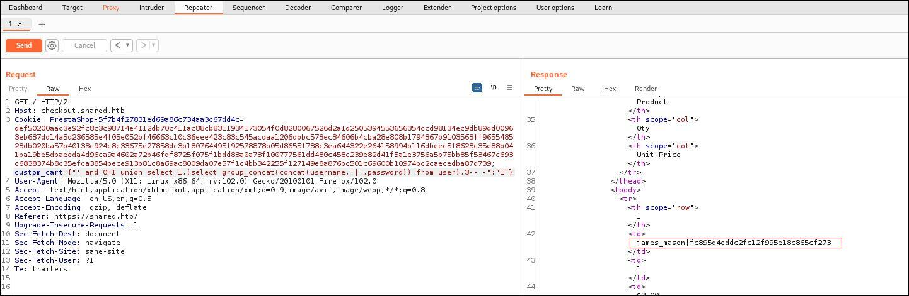

# Shared HTB

Une box Linux de difficulté Medium créée par [**Nauten**](https://app.hackthebox.com/users/27582) qui nous amènera à récupérer, grâce à une injection SQL, le hash du mot de passe d'un utilisateur dans la base de données derrière un site Prestashop. Puis elle nous permettra de compromettre un deuxième utilisateur en exploitant une vulnérabilité sur un package python ([**iPython Command Execution (CVE-2022-21699)**](https://github.com/ipython/ipython/security/advisories/GHSA-pq7m-3gw7-gq5x)). Ensuite, l'exploitation d'un binaire nous donnera un mot de passe qui nous donnera la possibilité de nous échapper d'une sandbox Redis ([**Redis LUA Sandbox Escape (CVE-2022-0543)**](https://thesecmaster.com/how-to-fix-cve-2022-0543-a-critical-lua-sandbox-escape-vulnerability-in-redis/)) avec les droits root.

## Enumeration

### NMAP

Premièrement, on lance un scan Nmap de la machine hôte avec les scripts de détection par défaut pour trouver des ports TCP ouverts.

3 services tournent dessus:
- SSH sur le port 22
- HTTP sur le port 80 avec un nom de domaine associé: **shared.htb**
- HTTPS sur le port 443 avec un nom de domaine associé: **shared.htb**

On est rediriger vers **http://shared.htb**, qui redirige lui-même vers **https://shared.htb**.

Ajoutons-le à notre fichier **/etc/hosts** et allons voir à quoi ressemble ce site web.

On accepte le certificat et on arrive sur un site Prestashop.

### GOBUSTER

On lance une attaque par dictionnaire avec [**Gobuster**](https://github.com/OJ/gobuster) pour énumérer les repertoires et fichiers à la racine du site en HTTP.

Une api avec quelques endpoints et un Makefile. 
Jetons un œil au fichier **robots.txt**.

On a la confirmation que Prestashop a été installé et partiellement fonctionnel.
Voyons si il y a des sous-domaine.

On trouve **checkout.shared.htb** mais rien n'est possible directement.

Reprenons les choses dans l'ordre, allons faire un peu de shopping.

Remplissons notre panier et dirigeons-nous vers la confirmation.

Nous revoila sur la page **checkout** mais avec des données à manipuler.

## EXPLOIT (SQL Injection)

Un champ **custom_cart** dans les cookies qui s'avère être vulnérable à une Injection SQL.

### BURPSUITE

On récupère le nom de la base de données, puis des tables... La table **user** peut contenir des informations intéressantes.

On récupère ses colonnes.

Un seul utilisateur enregistré **james_mason** et le hash de son mot de passe, en MD5 à première vue.

Essayons de cracker son mot de passe.

Mais on aurait aussi très bien pu enregistrer la requête dans un fichier depuis BurpSuite et utiliser SQLMap.

## FOOTHOLD

Avec son mot de passe, on peut se connecter en SSH à la machine cible.

Cet utilisateur fait partie du groupe **developer**, ce qui lui donne tout les droit sur le dossier **/opt/scripts_review**.

Mais pas encore de flag...

On sait qu'il y a un autre utilisateur, qui a lui aussi une configuration SSH dans son répertoire HOMEDIR.

(C'est surement lui qui détient le flag)

Uploadons [PsPy](https://github.com/DominicBreuker/pspy) sur la machine cible pour énumérer les processus en temps réel.

Il nous révèle un processus qui lance **iPython** (interactive python) depuis **/opt/scripts_review**.

### CVE-2022-21699

Après quelques recherches sur ce package, il comporte une [**vulnérabilité d'exécution de code arbitraire**](https://github.com/ipython/ipython/security/advisories/GHSA-pq7m-3gw7-gq5x) à travers un modèle de système de dossiers spécifique, à partir du répertoire courant.

On sait que **iPython** est lancé depuis **/opt/scripts_review** sur lequel nous avons les droits en écriture, et que la clé SSH **id_rsa** de l'utilisateur **dan_smith** est possiblement à notre portée durant l'exécution.

On créer un petit script **foo.py** pour récupérer la clé SSH. On le place dans le répertoire **profile_default/startup** à partir de celui dans lequel iPython est lancé.

## Lateral Movement 

### SSH

Si la clé n'a pas de mot de passe, on peut maintenant se connecter à la machine via le service SSH en tant que **dan_smith**.

Cette fois, cet utilisateur fait parti du groupe **sysadmin** avec un executable associé **redis_connector_dev** qui, d'après son nom, permet au developpeur de se connecter au système de gestion de base de données Redis, je suppose.

Il se connecte sur le port 6379 par défaut et utilise un mot de passe. 

On va le télécharger sur notre machine pour l'examiner.

Lançons le binaire en écoutant sur le port 6379 avec netcat pour intercepter l'authentification.

Il nous donne le mot de passe pour accéder au service Redis.

## Privilege Escalation

### CVE-2022-0543 (Lua Sandbox Escape)

On s'y connecte sans préciser d'utilisateur, ça doit être **default**, l'utilisateur par défaut de Redis.
Puis, on lance un [**script Lua**](https://thesecmaster.com/how-to-fix-cve-2022-0543-a-critical-lua-sandbox-escape-vulnerability-in-redis/) pour échapper au bac à sable Lua et lancer un reverse shell en bash.

Ca fonctionne pour lancer quelques commandes mais ce n'est pas stable, la connexion coupe au bout d'une minute environ.

J'ai continué en quête d'une meilleur méthode. 

### CHISEL

On va utiliser [**Chisel**](https://github.com/jpillora/chisel) pour faire du port forwarding, rediriger le port 6379 de la cible vers le port 6379 de notre machine en la faisant écouter sur le port 9999.

Pour mettre en place notre tunnel, il faut l'exécutable **chisel** sur les 2 machines.

Et on le télécharge sur la cible.

On met en place **chisel** en mode serveur en écoute sur le port 9999 de notre machine. 

Puis en mode client sur la cible sur le port 6379 en entrée et en sortie.

Nous pouvons maintenant utiliser le service Redis depuis notre machine comme si il y était.
Cette fois-ci, pour l'exploiter, nous allons utliser un [**script python**](https://github.com/aodsec/CVE-2022-0543/) trouver pendant mes recherches sur cette CVE.

Une fois le script modifié et ajusté pour notre situation, nous pouvons enfin récupérer le flag **root**.

Merci [**Nauten**](https://app.hackthebox.com/users/27582) à pour cette Box super intéressantes avec des CVEs récentes.

N'hésitez pas à aller lui donner du "respect" sur son profil si elle vous a plu.

### Liens:
- [**Gobuster**](https://github.com/OJ/gobuster)
- [**PsPy - unprivileged Linux process snooping**](https://github.com/DominicBreuker/pspy)
- [**iPython Command Execution (CVE-2022-21699)**](https://github.com/ipython/ipython/security/advisories/GHSA-pq7m-3gw7-gq5x)
- [**Chisel - TCP/UDP tunneling**](https://github.com/jpillora/chisel)
- [**Redis LUA Sandbox Escape POC (CVE-2022-0543)**](https://thesecmaster.com/how-to-fix-cve-2022-0543-a-critical-lua-sandbox-escape-vulnerability-in-redis/)
- [**Redis LUA Sandbox Escape original script (CVE-2022-0543)**](https://github.com/aodsec/CVE-2022-0543/)
- [**Profil HackTheBox de Nauten**](https://app.hackthebox.com/users/27582)

